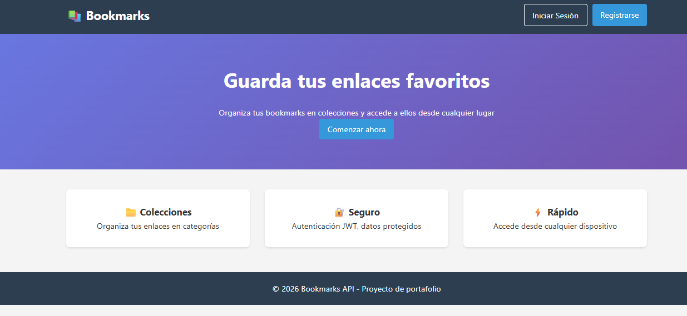
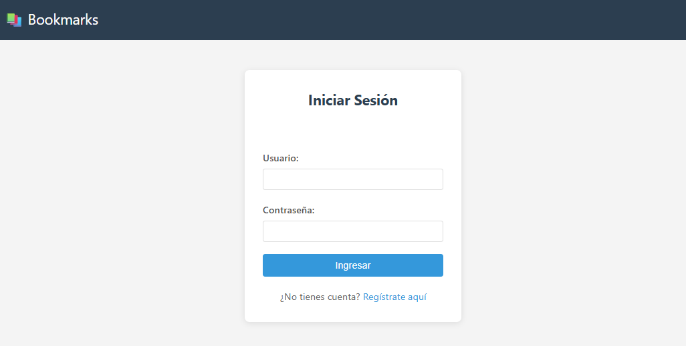
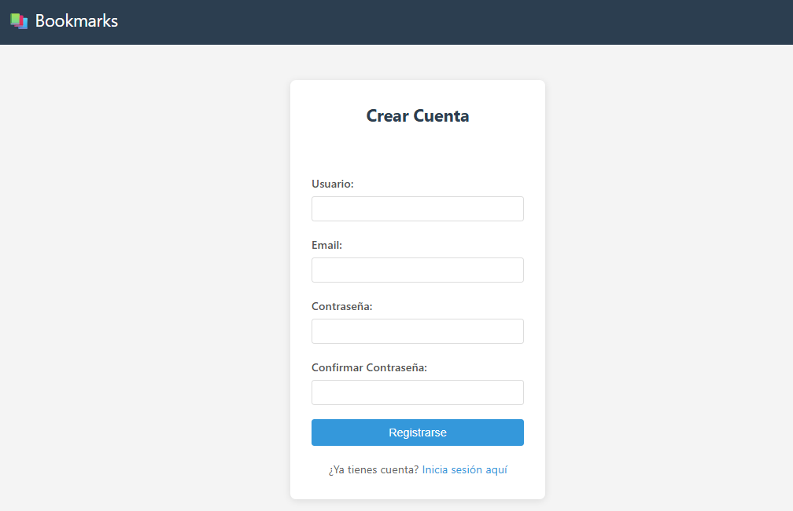
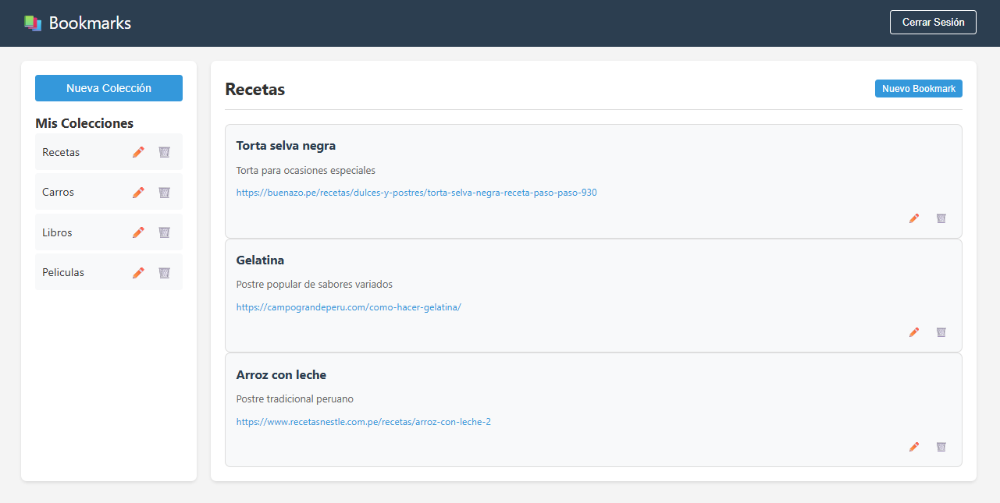

#  Bookmarks API - Gestión de Marcadores Personales

API REST para gestión de marcadores personales con autenticación JWT y frontend integrado. Los usuarios pueden crear colecciones y guardar sus enlaces favoritos de forma organizada.

##  Características

### Backend (Django REST Framework)
-  Autenticación JWT (access y refresh tokens)
-  Registro de usuarios
-  CRUD completo de colecciones
-  CRUD completo de bookmarks
-  Validaciones personalizadas
-  Permisos por usuario (cada usuario ve solo sus datos)

### Frontend (HTML/CSS/JS puro)
-  Interfaz responsive
-  Dashboard con colecciones y bookmarks
-  Modales para crear/editar
-  Manejo automático de tokens
-  Diseño limpio y funcional

##  Capturas de pantalla






##  Endpoints de la API

### Autenticación
| Método | Endpoint | Descripción |
|--------|----------|-------------|
| POST | `/api/registro/` | Registrar nuevo usuario |
| POST | `/api/token/` | Obtener tokens (login) |
| POST | `/api/token/refresh/` | Renovar access token |

### Colecciones
| Método | Endpoint | Descripción |
|--------|----------|-------------|
| GET | `/api/colecciones/` | Listar mis colecciones |
| POST | `/api/colecciones/` | Crear nueva colección |
| GET | `/api/colecciones/{id}/` | Ver detalle de colección |
| PUT | `/api/colecciones/{id}/` | Actualizar colección |
| DELETE | `/api/colecciones/{id}/` | Eliminar colección |

### Bookmarks
| Método | Endpoint | Descripción |
|--------|----------|-------------|
| GET | `/api/bookmarks/` | Listar mis bookmarks (con filtro ?coleccion=id) |
| POST | `/api/bookmarks/` | Crear nuevo bookmark |
| GET | `/api/bookmarks/{id}/` | Ver detalle de bookmark |
| PUT | `/api/bookmarks/{id}/` | Actualizar bookmark |
| DELETE | `/api/bookmarks/{id}/` | Eliminar bookmark |

##  Tecnologías utilizadas

### Backend
- Python 3.13
- Django 6.0
- Django REST Framework
- Simple JWT (autenticación)
- SQLite (base de datos)

### Frontend
- HTML5
- CSS3
- JavaScript (Vanilla)
- Fetch API

##  Instalación local

### Prerrequisitos
- Python 3.8+
- Git

### Pasos de instalación

1. **Clonar el repositorio**
   ```bash
   git clone https://github.com/angel2024-rgb/bookmarksProject.git
   cd bookmarksProject
   ```

2. **Crear y activar entorno virtual**
   ```bash
   # Windows
   python -m venv venv
   venv\Scripts\activate

   # Mac/Linux
   python3 -m venv venv
   source venv/bin/activate
   ```

3. **Instalar dependencias**
   ```bash
   pip install -r requirements.txt
   ```

4. **Realizar migraciones**
   ```bash
   python manage.py migrate
   ```

5. **Ejecutar servidor**
   ```bash
   python manage.py runserver
   ```

6. **Acceder a la aplicación**
   - Frontend: http://localhost:8000/
   - Admin: http://localhost:8000/admin/

###  Cómo usar la aplicación

1.  **Regístrate** como nuevo usuario en `/registro/`
2.  **Inicia sesión** en `/login/`
3.  **Crea colecciones** desde el dashboard
4.  **Añade bookmarks** a tus colecciones
5.  **Organiza** tus enlaces favoritos

###  Autor

**Ángel Paredes**  
- GitHub: [@angel2024-rgb](https://github.com/angel2024-rgb)

---
